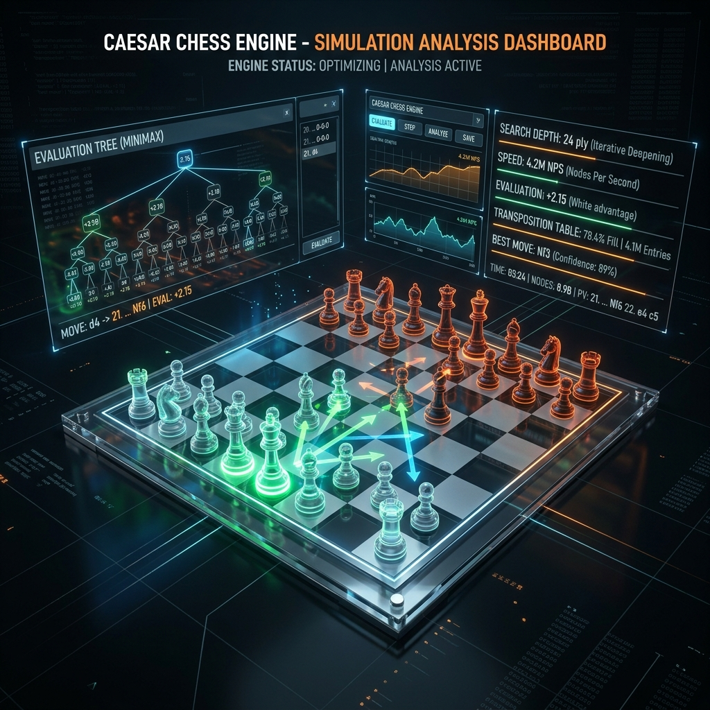

# Caesar Chess Engine (v1.0)

<p align="center">
  
</p>

Caesar is a high-performance, command-line chess engine written in C. It represents chess state using a hybrid **Mailbox 10x12 (120-square) representation** mapped to **64-bit Bitboards** for optimized pawn and attack calculations. Caesar implements a complete classical computer chess architecture: iterative deepening minimax search, alpha-beta pruning, transposition tables, sophisticated move ordering, and positional heuristics.

---

## Technical Architecture Overview

Caesar separates chess playing into three clean decoupled concerns: state representation, search strategy, and positional evaluation.

```
                    ┌───────────────────────────┐
                    │  Protocols (UCI/Console)  │
                    └─────────────┬─────────────┘
                                  │
                                  ▼
                    ┌───────────────────────────┐
                    │       Search Engine       │◄───► [ Transposition Table ]
                    │    (Alpha-Beta / ID)      │      (Zobrist Hash Table)
                    └──────┬──────────────┬─────┘
                           │              │
                           ▼              ▼
            ┌─────────────────┐    ┌──────────────┐
            │ Move Generator  │    │  Evaluation  │◄───► [ Opening Book ]
            │ (Pseudo-Legal)  │    │  (PST/Pawn)  │
            └──────┬──────────┘    └──────┬───────┘
                   │                      │
                   └──────────┬───────────┘
                              ▼
                    ┌───────────────────────────┐
                    │        Board State        │
                    │ (Mailbox 10x12 + Bitboard)│
                    └───────────────────────────┘
```

---

## Board Representation & Bitboards

Caesar utilizes a dual-board structure to combine the benefits of $O(1)$ coordinate off-board check validation with vector-like bit operations:
*   **Mailbox Array (`int pieces[120]`)**: Represents the board. An $8\times8$ board is padded with a boundary width of 2 squares to prevent illegal array indexing on knight jumps or sliding moves. Any coordinate with value `OFFBOARD` represents an illegal target.
*   **Bitboards (`U64 pawns[3]`)**: 64-bit unsigned integers representing white, black, and combined pawn structures. Bitboards enable fast bitwise operations for pawn structure analysis (isolated pawns, passed pawns) via clearing and set masks.

### 120-Square Mailbox Board Grid Layout
Below is the physical array structure indicating active file coords (21 to 98) and padding boundaries (99 = `OFFBOARD` / `NO_SQ`):

```
     FILE_A  FILE_B  FILE_C  FILE_D  FILE_E  FILE_F  FILE_G  FILE_H
   ┌─────────────────────────────────────────────────────────────────┐
 9 │   99      99      99      99      99      99      99      99    │ (Boundary)
 8 │   99      91      92      93      94      95      96      97    │ (Row 8)
 7 │   99      81      82      83      84      85      86      87    │ (Row 7)
 6 │   99      71      72      73      74      75      76      77    │ (Row 6)
 5 │   99      61      62      63      64      65      66      67    │ (Row 5)
 4 │   99      51      52      53      54      55      56      57    │ (Row 4)
 3 │   99      41      42      43      44      45      46      47    │ (Row 3)
 2 │   99      31      32      33      34      35      36      37    │ (Row 2)
 1 │   99      21      22      23      24      25      26      27    │ (Row 1)
 0 │   99      99      99      99      99      99      99      99    │ (Boundary)
   └─────────────────────────────────────────────────────────────────┘
       0       1       2       3       4       5       6       7
```

### Index Conversions
Convert between the compact 64-square representation and 120-square representation:
$$\text{Sq120}(x, y) = 21 + x + 10y \quad \text{where} \quad x \in [0,7], y \in [0,7]$$

---

## 32-Bit Move Encoding Scheme

To maintain search efficiency, moves are encoded into a single 32-bit unsigned integer containing coordinate pointers and control flags:

```
┌─────────────────┬───────────┬───────────┬─────────┬───┬───┬───────────┬───────────┐
│     Unused      │ Prom. Pce │ Cap. Pce  │ EP Flag │ PS│ CA│   To Sq   │  From Sq  │
│    (8 bits)     │ (4 bits)  │ (4 bits)  │ (1 bit) │(1)│(1)│ (7 bits)  │ (7 bits)  │
└─────────────────┴───────────┴───────────┴─────────┴───┴───┴───────────┴───────────┘
31              24 23       20 19       16 15        14  13  12        6 5         0
```

*   **From Sq (Bits 0-6)**: Origin square index (21 to 98).
*   **To Sq (Bits 7-13)**: Destination square index (21 to 98).
*   **Castling Flag (Bit 14)**: Asserted if the move is a castling action (`MFLAGCA = 0x1000000`).
*   **Pawn Start (Bit 15)**: Asserted if the pawn moves two squares forward (`MFLAGPS = 0x80000`).
*   **En Passant (Bit 16)**: Asserted if the move is an en-passant capture (`MFLAGEP = 0x40000`).
*   **Captured Pce (Bits 17-20)**: Type of captured piece (`wP` through `bK`).
*   **Promoted Pce (Bits 21-24)**: Type of piece the pawn promoted to (`wN` through `bK`).

---

## Search Engine & Alpha-Beta Pruning

The search engine performs a depth-bounded depth-first search using **Minimax with Alpha-Beta Pruning** and **Iterative Deepening**. 

### Alpha-Beta Decision Rule
For each node with depth $d$, search window $[\alpha, \beta]$:
$$V(d, \alpha, \beta) = \max \left( \alpha, \min \left( \beta, \max_{m \in \text{Moves}} \left( -V(d-1, -\beta, -\alpha) \right) \right) \right)$$

```
                         [Alpha, Beta]
                         /           \
                 Score >= Beta      Score < Beta
                 (Beta Cutoff)      (Refine Alpha)
                 /                  /            \
          Prune Subtree      Alpha = Score    Continue Search
```

### Advanced Search Heuristics
1.  **Iterative Deepening**: Begins with a quick depth-1 search and increments depth step-by-step. This guarantees that search time constraints can interrupt the search gracefully and yields optimal move sorting tables for deeper plies.
2.  **Quiescence Search**: Solves the *horizon effect*. Once the search depth reaches zero, Caesar switches to searching only capture moves to compute a quiet evaluation state:
    $$\text{Quiescence}(\alpha, \beta) = \max \left( \text{Eval}(s), \max_{c \in \text{Captures}} \left( -\text{Quiescence}(-\beta, -\alpha) \right) \right)$$
3.  **Null Move Pruning**: If the side to move is not in check and has major pieces remaining, a "null move" is executed to yield a turn to the opponent. If the reduced search ($\text{depth} - 4$) still scores $\ge \beta$, the subtree is pruned.
4.  **Killer Move Heuristic**: Prioritizes non-capture moves that recently caused beta cutoffs at the same search ply (`searchKillers[2][MAXDEPTH]`).
5.  **History Heuristic**: Maintains a weight matrix of moves based on how often they caused cutoffs during the search loop (`searchHistory[Piece][TargetSquare]`).

---

## Transposition Table & Zobrist Hashing

To avoid redundant computations on transposition pathways (e.g. `1. e4 e6 2. d4 d5` vs `1. d4 d5 2. e4 e6`), positions are cached in a hash table indexed using a **64-bit Zobrist Hash Key**:
$$\text{posKey} = \left( \bigoplus_{i=0}^{119} \text{PieceKeys}[\text{piece}][i] \right) \oplus \text{SideKey} \oplus \text{CastleKeys}[\text{castlePerm}] \oplus \text{EnPassantKeys}[\text{enPas}]$$
Each hash entry stores:
*   `posKey`: Position signature.
*   `move`: The best move found in this position.
*   `score`: Evaluated score (exact, upper bound/alpha, or lower bound/beta).
*   `depth`: Search depth at which the entry was cached.
*   `flags`: Cache hit bounds classification (`HFEXACT`, `HFALPHA`, `HFBETA`).

---

## Move Ordering (MVV-LVA)

Efficient alpha-beta pruning depends heavily on ordering moves. Caesar sorts moves based on:
1.  **PV Move**: The best move found during the previous iterative deepening ply is evaluated first.
2.  **MVV-LVA (Most Valuable Victim - Least Valuable Attack)**: Capture moves are prioritized to find early beta cutoffs. The ordering score is calculated as:
    $$\text{Score}_{\text{MVV-LVA}} = \text{Value}(\text{Victim}) + (6 - \text{Value}(\text{Attacker}))$$
    For instance, a Pawn capturing a Queen ($105$ points) is prioritized over a Rook capturing a Queen ($101$ points).
3.  **Killer Moves**: Prioritized right after captures.
4.  **History Heuristics**: Prioritized for general positional moves.

---

## Evaluation Heuristics

The evaluation function computes the positional advantage in centipawns ($1 \text{ pawn} = 100 \text{ centipawns}$):
$$\text{Eval} = \text{MaterialScore} + \text{PSTScore} + \text{PawnStructureScore} + \text{MobilityScore}$$

### 1. Material Values
*   **Pawn**: $100$
*   **Knight / Bishop**: $325$
*   **Rook**: $550$
*   **Queen**: $975$
*   **King**: $50,000$

### 2. Piece-Square Tables (PST)
Positional values mapped dynamically per coordinate to reward center control, king safety, and active piece development.

```
       PAWN TABLE                       KNIGHT TABLE                     BISHOP TABLE
   ┌────────────────────────┐       ┌────────────────────────┐       ┌────────────────────────┐
 8 │  0   0   0   0   0   0  0  0│     │  0 -10   0   0   0   0 -10  0│     │  0   0 -10   0   0 -10  0  0│
 7 │ 10  10  0 -10 -10   0 10 10│     │  0   0   0   5   5   0   0  0│     │  0   0   0  10  10   0  0  0│
 6 │  5   0   0   5   5   0  0  5│     │  0   0  10  10  10  10   0  0│     │  0   0  10  15  15  10  0  0│
 5 │  0   0  10  20  20  10  0  0│     │  0   0  10  20  20  10   5  0│     │  0  10  15  20  20  15 10  0│
 4 │  5   5   5  10  10   5  5  5│     │  5  10  15  20  20  15  10  5│     │  0  10  15  20  20  15 10  0│
 3 │ 10  10  10  20  20  10 10 10│     │  5  10  10  20  20  10  10  5│     │  0   0  10  15  15  10  0  0│
 2 │ 20  20  20  30  30  20 20 20│     │  0   0   5  10  10   5   0  0│     │  0   0   0  10  10   0  0  0│
 1 │  0   0   0   0   0   0  0  0│     │  0   0   0   0   0   0   0  0│     │  0   0   0   0   0   0  0  0│
   └────────────────────────┘       └────────────────────────┘       └────────────────────────┘
      a   b   c   d   e   f  g  h          a   b   c   d   e   f  g  h          a   b   c   d   e   f  g  h

       ROOK TABLE                     KING ENDGAME (KingE)             KING OPENING (KingO)
   ┌────────────────────────┐       ┌────────────────────────┐       ┌────────────────────────┐
 8 │  0   0   5  10  10   5  0  0│     │-50 -10   0   0   0   0 -10 -50│     │  0   5   5 -10 -10   0 10  5│
 7 │  0   0   5  10  10   5  0  0│     │-10   0  10  10  10  10   0 -10│     │-30 -30 -30 -30 -30 -30 -30 -30│
 6 │  0   0   5  10  10   5  0  0│     │  0  10  20  20  20  20  10   0│     │-50 -50 -50 -50 -50 -50 -50 -50│
 5 │  0   0   5  10  10   5  0  0│     │  0  10  20  40  40  20  10   0│     │-70 -70 -70 -70 -70 -70 -70 -70│
 4 │  0   0   5  10  10   5  0  0│     │  0  10  20  40  40  20  10   0│     │-70 -70 -70 -70 -70 -70 -70 -70│
 3 │  0   0   5  10  10   5  0  0│     │  0  10  20  20  20  20  10   0│     │-70 -70 -70 -70 -70 -70 -70 -70│
 2 │ 25  25  25  25  25  25 25 25│     │-10   0  10  10  10  10   0 -10│     │-70 -70 -70 -70 -70 -70 -70 -70│
 1 │  0   0   5  10  10   5  0  0│     │-50 -10   0   0   0   0 -10 -50│     │-70 -70 -70 -70 -70 -70 -70 -70│
   └────────────────────────┘       └────────────────────────┘       └────────────────────────┘
      a   b   c   d   e   f  g  h          a   b   c   d   e   f  g  h          a   b   c   d   e   f  g  h
```

### 3. Positional Factors
*   **Bishop Pair**: $+30$ centipawns bonus.
*   **Pawn Structure**:
    *   *Isolated Pawn Penalty* ($-10$): Applied to friendly pawns without friendly support on adjacent files.
    *   *Passed Pawn Bonus*: Increases with promotion proximity (0, 5, 10, 20, 35, 60, 100, 200).
*   **Rook/Queen Open Files**: Awards $+10$ bonus for fully open files and $+5$ for semi-open files.
*   **King Safety Transition**: King positional scores swap from `KingO` (punishes king exposure) to `KingE` (encourages central active king involvement) when opponent major material drops below:
$$\text{Endgame Threshold} = 1 \times \text{Val}(\text{Rook}) + 2 \times \text{Val}(\text{Knight}) + 2 \times \text{Val}(\text{Pawn}) + \text{Val}(\text{King})$$

---

## File Structure

```
caesar-chess-engine/
├── attack.c          # Attack detection functions (is square attacked by side?)
├── bitboard.c        # 64-bit bitboard operations (pop, count, print)
├── board.c           # Board initialization, FEN parsing, and state updates
├── data.c            # Lookup masks, piece square tables, mirror maps
├── defs.h            # Main headers, constants, structures, and macros
├── evaluate.c        # Positional evaluation (Material, PST, Passed Pawns)
├── hashkeys.c        # Zobrist hash key generators
├── init.c            # Global arrays and mask initializations
├── io.c              # Move parsing, console outputs, FEN validation
├── main.c            # Command loop and application entrypoint
├── makemove.c        # Board state update and rollback logic (Make/Take move)
├── misc.c            # Time check and I/O buffer readings
├── movegen.c         # Pseudo-legal move generator (all moves & caps-only)
├── perft.c           # Move generator performance tester
├── polybook.c        # Polyglot opening book parser
├── pvtable.c         # Transposition hash table manager
├── search.c          # Alpha-beta, iterative deepening, quiescence search
├── uci.c             # Universal Chess Interface implementation
├── validate.c        # Board and move verification tests
└── xboard.c          # XBoard/Winboard protocol interface
```

---

## Verification & Perft Testing

Caesar's move generator and move execution accuracy can be validated using the Performance Test (`perft` command), which recursively runs leaf node configurations.

### Perft Node Counts (Initial State)
*   **Depth 1**: $20$ nodes
*   **Depth 2**: $400$ nodes
*   **Depth 3**: $8,902$ nodes
*   **Depth 4**: $197,281$ nodes
*   **Depth 5**: $4,865,609$ nodes

---

## Building and Running

### Compilation
Build the executable using `gcc` or `clang`:

```bash
# Compile with optimizations
gcc -O3 -std=c99 attack.c bitboard.c board.c data.c hashkeys.c init.c io.c main.c makemove.c misc.c movegen.c perft.c polybook.c pvtable.c search.c uci.c validate.c xboard.c -o caesar
```

### Running the Engine

You can run Caesar in **console mode** directly for debugging, or connect it to chess GUIs (like Arena, Winboard, or Cutechess) using supported protocols:

#### Console Interactive Mode:
```bash
./caesar
# Type "help" or "console" for direct command mode
```

#### Universal Chess Interface (UCI):
```bash
./caesar
# Type "uci" to initiate UCI handshake
# Enter standard commands like:
#   position startpos moves e2e4
#   go depth 6
```
